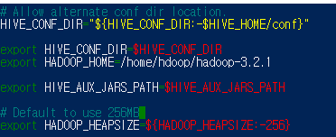
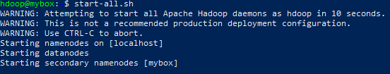
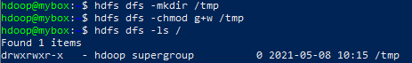
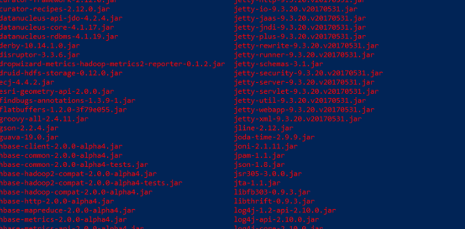
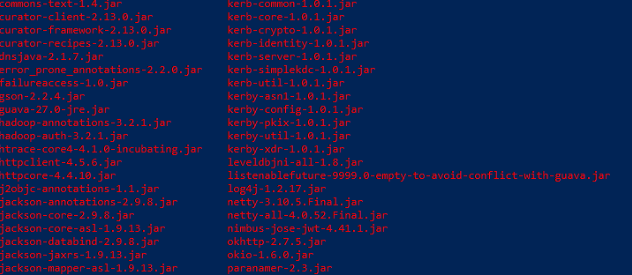
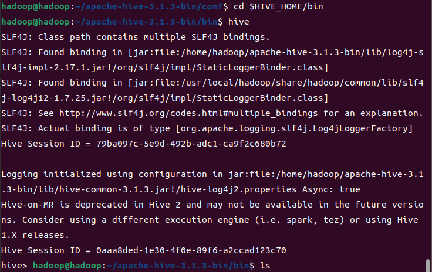

### 1. Hive 다운 및 압축 해제하기

1) wget https://downloads.apache.org/hive/hive-3.1.3/apache-hive-3.1.3-bin.tar.gz
2) tar xzf apache-hive-3.1.3-bin.tar.gz
ls 로 압축 해제 완료를 확인하자

—

### 2. Hive 환경 변수 설정하기(bashrc)

1) **nano .bashrc**
.bashrc의 맨 밑에 아래의 문구를 추가시켜주고, ctrl+x -> y -> enter로 저장한다.
```bash
export HIVE_HOME=“/home/hdoop/apache-hive-3.1.3-bin”
export PATH=$PATH:$HIVE_HOME/bin
```
2) **source ~/.bashrc**

—
### 3. hive-config.sh 파일 편집하기

- **Hive는 HDFS와 상호작용을 해야된다.

1) **nano $HIVE_HOME/bin/hive-config.sh**
2) **export HADOOP_HOME=/home/hadoop/hadoop-3.2.1**
> HADOOP_HOME 의 경우 nano .bashrc 안에 적힌 위치와 동일하게 입력하자

저장하고 나옴

—
### 4. HDFS에 Hive directory 만들기

- hdfs layer에 데이터를 저장하기 위해 분리된 두 개의 디렉토리를 생성
- (tmp 와 다른 하나 메인)
- HDFS를 사용하므로 hadoop 먼저실행 **(start-dfs.sh)**

**1) tmp directory 생성**
-tmp directory는 Hive process의 중간 데이터 결과를 저장하는 용도로 사용하자

1-1) `hdfs dfs -mkdir /tmp`

1-2) `hdfs dfs -chmod g+w /tmp`
쓰기 실행 권한 부여

1-3) `hdfs dfs -ls /`
권한 추가되었는지 확인



**2) warehouse directory 생성**
2-1) `hdfs dfs -mkdir -p /user/hive/warehouse`
2-2) `hdfs dfs -chmod g+w /user/hive/warehouse`
2-3) `hdfs dfs -ls /user/hive`

—
### 5. hive-site.xml 파일 설정하기

1) `cd $HIVE_HOME/conf`
2) `cp hive-default.xml.template hive-site.xml`
cp a b : a를 b 이름으로 복제본 만듦
3) `nano hive-site.xml`
-property 로 시작되는 부분을 찾아 아래의 두 개의 property를 추가시키자.
```xml
<property>
    <name>system:jave.io.tmpdir</name>
    <value>/tmp/hive/java</value>
</property>

<property>
    <name>system:user.name</name>
    <value>${user.name}</value>
</property>
```
그 이후 `Ctrl + w` 키로 검색창을 켜고 `javax.jdo.option.ConnectionURL` 을 검색하여 property를 찾고 value 를 `jdbc:derby:/home/hdoop/apache-hive3.1.3-bin/metastore\_db;databaseName=metastore\_db;create=true`로 수정해주자

—
### 6. derby database 시작하기
`$HIVE_HOME/bin/schematool -initSchema -dbType derby` 을 실행해야하는데 오류가 날 것이다. (java.lang.NoSuchMethodError)
hadoop ↔ hive 간 guava version 호환성 문제를 해결하러 가자

1) `ls $HIVE_HOME/lib`


hive의 guava version 은 19.0

2) `ls $HADOOP_HOME/share/hadoop/hdfs/lib`


hadoop의 guava version 은 27.0

3) `rm $HIVE_HOME/lib/guava-19.0jar`
- hive의 guava 삭제
4) `cp $HADOOP_HOME/share/hadoop/hdfs/lib/guava-27.0-jre.jar $HIVE_HOME/lib/`
- hadoop의 guava를 hive에 복사

다시 `$HIVE_HOME/bin/schematool -initSchema -dbType derby`
또 에러 발생! line 3223, column96 에 이상한 문자가 있다

`cd $HIVE_HOME/conf` 로 이동해서 
`nano hive-site.xml` 켜고
`ctrl + shift + -` 입력하면 행,열 이동가능 `3223,96` 입력해서 특수기호 들어간 것들 지워주자.
 `$HIVE_HOME/bin/schematool -initSchema -dbType derby` 재시도.
 
 —
 ### 7. HIVE Client Shell 시작하기
 1) `cd $HIVE_HOME/bin`
 2) `hive`
 
 

—
### 부록 hql 파일 생성 및 실행
1) `touch 이름.hql`
2) `nano 이름.hql` or 파일 직접 들어가서 작성
3) `hive -f 이름.hql` 하면 실행 됨

#### hive 명령어 아무데서 나 막 치면 안 됨.

**HiveException java.lang.RuntimeException: Unable to instantiate**
오류뜰 때 팁.
```bash
rm -rf metastore_db/
schematool -initSchema -dbType derby
```

- start-dfs..sh 이후에 바로 `hive` 명령어 X / 하둡 실행되는 동안 초기 몇 초는 safe mode 돌입됨.

hdfs 의 문서를 hive 에 가져오는 방법
```sql
DROP TABLE IF EXISTS MULGA;

CREATE EXTERNAL TABLE IF NOT EXISTS MULGA (
a DATE,
b STRING,
c INT,
d STRING,
e STRING,
f INT,
g STRING,
h INT,
i INT
)
ROW FORMAT DELIMITED
FIELDS TERMINATED BY '\t'
STORED AS TEXTFILE
LOCATION '/user/hive/mulga'
tblproperties ("skip.header.line.count"="1");

DROP TABLE IF EXISTS TEST;

CREATE EXTERNAL TABLE IF NOT EXISTS TEST (
a DATE,
b STRING,
c INT,
d STRING,
e STRING,
f INT,
g STRING,
h INT,
i INT
)
STORED AS ORC
LOCATION '/user/hive/test';

INSERT OVERWRITE TABLE TEST
SELECT * FROM MULGA;
```
  
```sql
export table 테이블이름 to '폴더';
```

#### 팁 ) auto_increment hive에 적용시키기

```
hive>add jar /home/hadoop/hive/lib/hive-contrib-3.1.2.jar;

hive>create temporary function row_sequence as 'org.apache.hadoop.hive.contrib.udf.UDFRowSequence';
```
하고 나서 덮어씌울 테이블을 준비한 뒤
```sql
insert overwrite table 그것
select row_sequence(), 컬럼들
from something;
```
#### 팁) date type 활용하기
```sql
select date_format(컬럼, 'yyyy-MM-dd')
-> 결과 : 2022-09-27
select date_format(컬럼, 'yyyy-MM')
-> 결과 : 2022-09
```


- Hive 3.0 이상 부터 Mapreduce 를 권장하지 않는다 spark / tez 로 변경을 추천하지만 tez 환경설정 도중 classpath 가 오류가 나는지 hive가 작동을 하지 않는다… 이후 계속 고민해 봐야할 부분 (버전마다, 블로그마다 )


### mysql 연동에 관한 고찰

- **hive-site.xml**

```xml
<configuration>
    <property>   
        <name>hive.metastore.local</name>   
        <value>false</value>   
    </property>   
    <property>   
        <name>hive.metastore.warehouse.dir</name>
        <value>/user/hive/warehouse</value>
    </property>
    <property>
        <name>javax.jdo.option.ConnectionURL</name>
        <value>jdbc:mysql://master:3306/hive?createDatabaseIfNotExist=true</value>
    </property>
    <property>
        <name>javax.jdo.option.ConnectionUserName</name>
        <value>hive</value>
    </property>
    <property>
        <name>javax.jdo.option.ConnectionPassword</name>
        <value>hive</value>
    </property>
</configuration>
```
connectionURL 예시 :    ` jdbc:mysql://localhost/metastore?createDatabaseIfNotExist=true`
##### 접속하기
- `mysql -u root -p`
- 비밀번호 입력은 root 계정 비밀번호
- 들어와서 `CREATE USER '생성할 id'@'%' IDENTIFIED BY '비밀번호';`
- `GRANT all on *.* to '생성할 id'@'%';`
- `flush privileges;`

`schematool -dbType mysql -initSchema`

`schematool -initSchema -dbType mysql -userName ssafy -passWord 'BigDataDDP77!' -verbose`


—

### Apache Sqoop
> 스쿱은 구조화된 관계형 데이터 베이스와 아파치 하둡간의 대용량 데이터들을 효율적으로 변환하여 주는 명령 줄 인터페이스 애플리케이션

```bash
wget http://mirror.navercorp.com/apache/sqoop/1.4.7/sqoop-1.4.7.bin__hadoop-2.6.0.tar.gz
tar -xvf sqoop-1.4.7.bin__hadoop-2.6.0.tar.gz
ln -s sqoop-1.4.7.bin__hadoop-2.6.0 sqoop
```
심볼릭 링크 설정 후 환경변수 설정
```bash
nano ~/.bashrc

export SQOOP_HOME=/home/user이름/sqoop
export SQOOP_CONF_DIR=$SQOOP_HOME/conf
export PATH=$PATH:SQOOP_HOME/bin

export HCAT_HOME=/home/user이름/hive폴더/hcatalog

source ~/.bashrc
```
- **HCAT_HOME 설정해야 하는 이유**
sqoop 으로 hive 의 ORC 형식의 table을 export 할 경우 hcatalog 옵션을 추가해야 하기 때문. `Exception in thread "main" java.lang.NoClassDefFoundError: org/apache/hive/hcatalog/mapreduce/HCatOutputFormat` 이 오류가 나지 않게 하기 위해서.

Sqoop 에 하둡설정을 추가해야 한다.
```bash
cp sqoop/conf/sqoop-env-template.sh sqoop/conf/sqoop-env.sh
cd sqoop/conf/
nano sqoop-env.sh
```

```bash
export HADOOP_HOME=/home/user이름/hadoop
export HADOOP_COMMON_HOME=/home/user이름/hadoop
export HADOOP_MAPRED_HOME=/home/user이름/hadoop
export HIVE_HOME=/home/user이름/hive
```

이제 Sqoop 에 DBMS 연결 드라이버를 넣어야 한다.
```bash
mv mysql-connector-java-8.0.22.jar /home/hadoop/sqoop/lib
```
SQOOP의 jar 파일을 하둡에 넣어야 한다.
```bash
cd sqoop
cp sqoop-1.4.7.jar /home/hadoop/hadoop/share/hadoop/tools/lib/
```

`java.lang.NoClassDefFoundError: org/apache/commons/lang/StringUtils` 오류뜨는 꼴 안보려면 commons-lang 설치하러 가자.
```bash
wget https://mirror.navercorp.com/apache//commons/lang/binaries/commons-lang-2.6-bin.tar.gz
tar -xvf commons-lang-2.6-bin.tar.gz
cd commons-lang-2.6
cp commons-lang-2.6.jar /home/hadoop/sqoop/lib
```
이후 겹치는 파일을 수정해준다.
```bash
cd /home/hadoop/sqoop/lib/
ll common*
mv commons-lang3-3.4.jar commons-lang3-3.4.jar.bak
```
- mysql 프로세스 재구동
```bash
systemctl restart mysql
```

##### sqoop 으로 RDB 연동
```bash
sqoop help
```
입력하면 hbase, zookeeper 등 warning이 경로설정 안했다는 warning 뜨면 성공!!

이제 orc 타입의 table 을 hive 에 만들러 가자
```sql
create table customers(컬럼들) row format delimited fields terminated by ',' stored as orc;
```
데이터 집어넣은 다음에

```bash
sqoop export -connect jdbc:mysql://j7a305.p.ssafy.io:3306/gamul_db -username ssafy -P --table mysql에준비된테이블 --hcatalog-database default --hcatalog-table hive의테이블이름
```

—
#### hive에서 update 하기.
hive에서 update 나 delete를 시도하면 `### FAILED: SemanticException \[Error 10294\]: Attempt to do update or delete using transaction manager that does not support these operations.` 오류가 발생한다.
이를 해결하기 위해 확인해야하는 설정들은 hive-site.xml 에서
```
hive.auto.convert.join.noconditionaltask.size = 10000000
hive.support.concurrency = true
hive.enforce.bucketing = true
hive.exec.dynamic.partition.mode = nonstrict
hive.txn.manager = org.apache.hadoop.hive.ql.lockmgr.DbTxnManager
hive.compactor.initiator.on = true
hive.compactor.worker.threads = 1
```
목록들을 확인하고 create table 설정 중 `tblproperties("transactional" = "true")` 설정한 테이블을 생성하면 거기서 update / delete 를 실행할 수 있다.

**그러나** 나의 문제는 hive에서 subquery 를 지원안한다는 것. update 를 다른 table 에서 찾아와서 수정하는 과정을 지원하지 않는다.
-> 자체를 overwrite 해버릴 것이고 `left join` 으로 해결
```sql
insert overwrite table table2 
select t1.id, 
       t2.Date,
       t2.amount 
from table2 t2 left join table t1 
     on t1.id=t2.id
```
이런 느낌