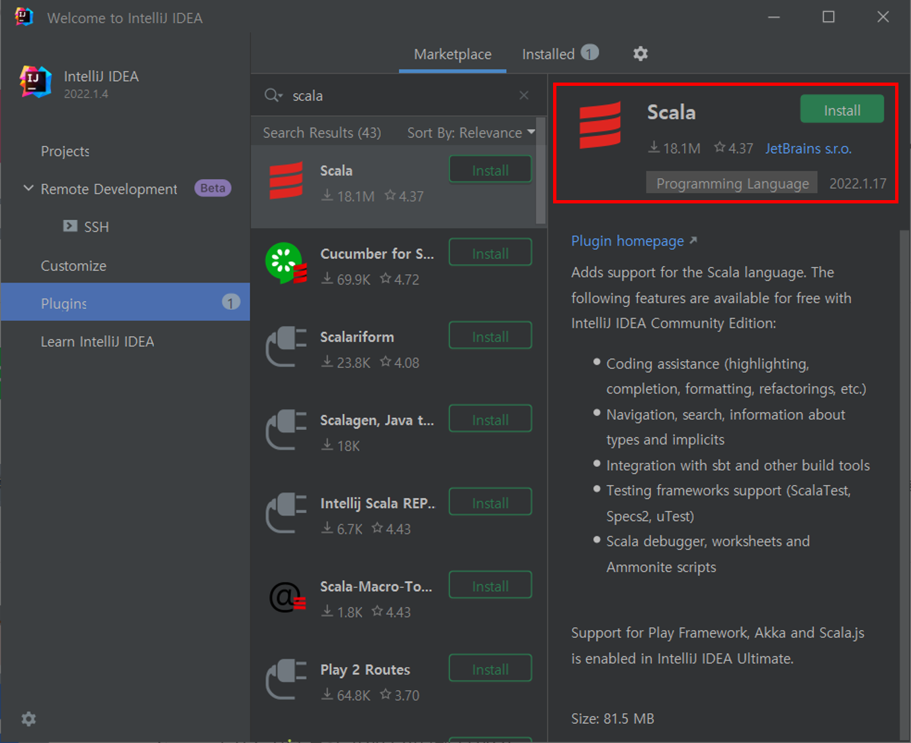
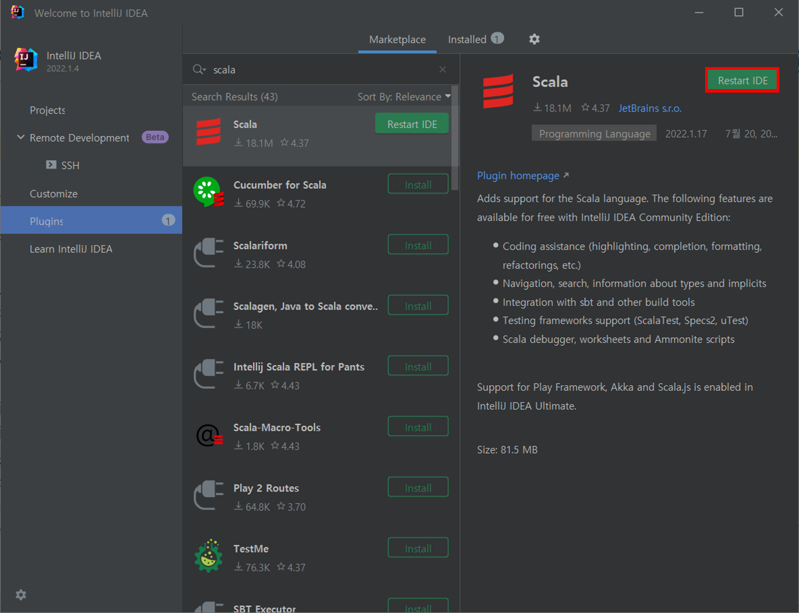
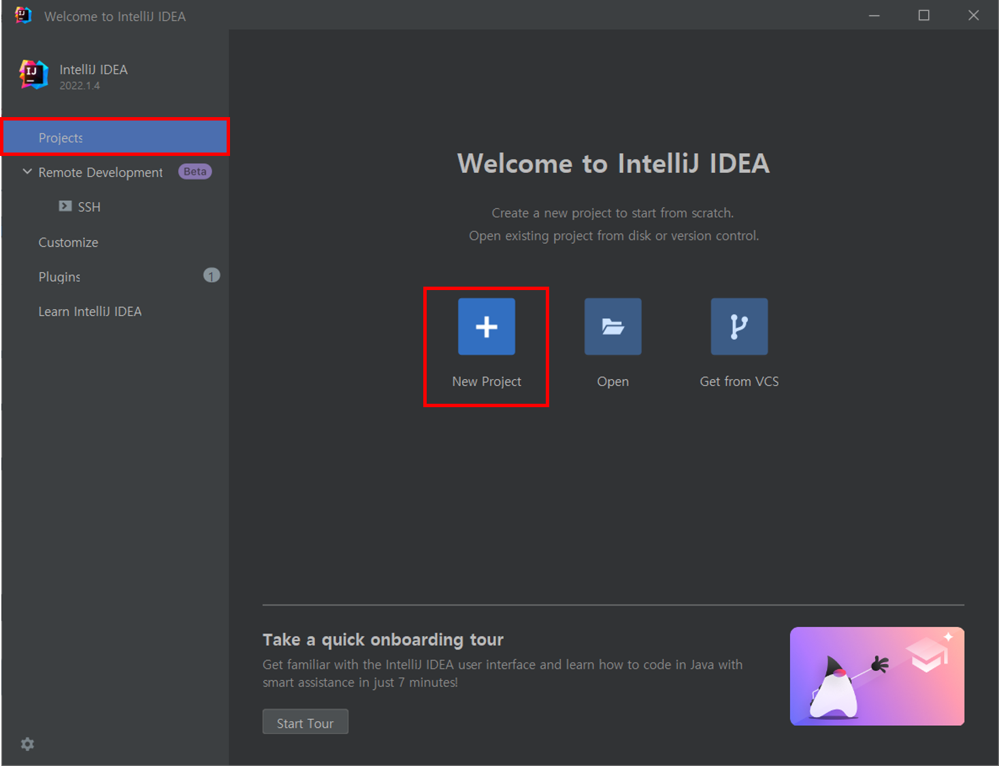
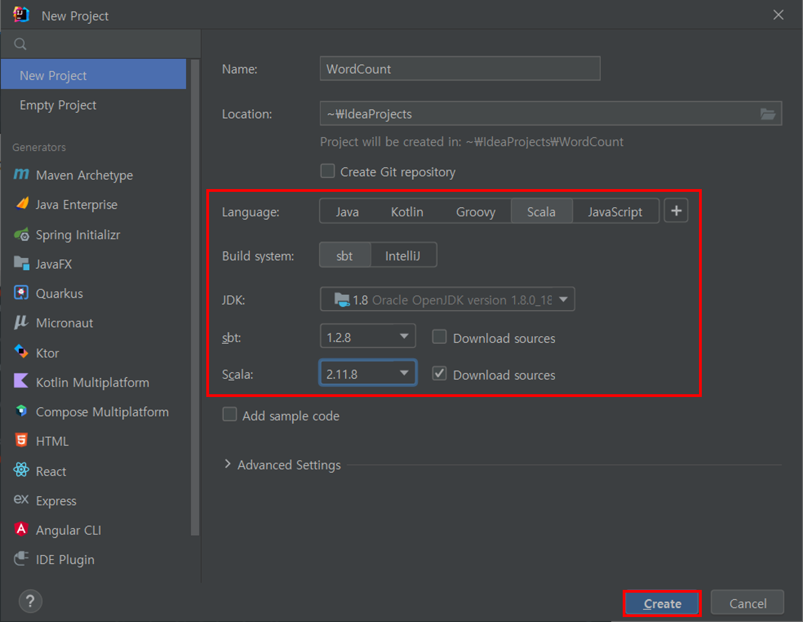
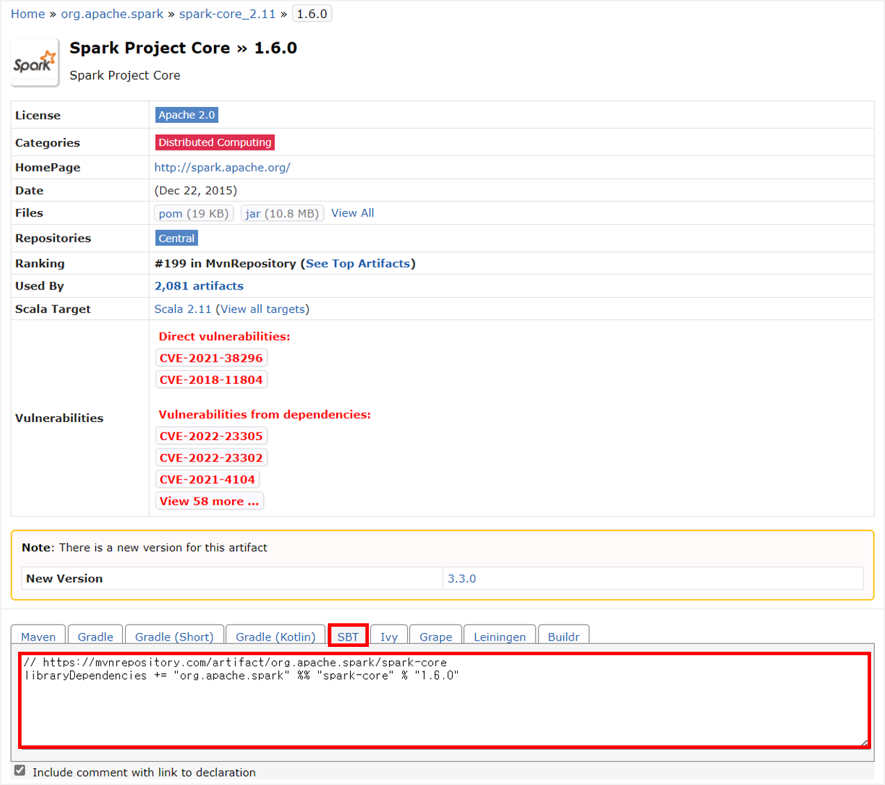
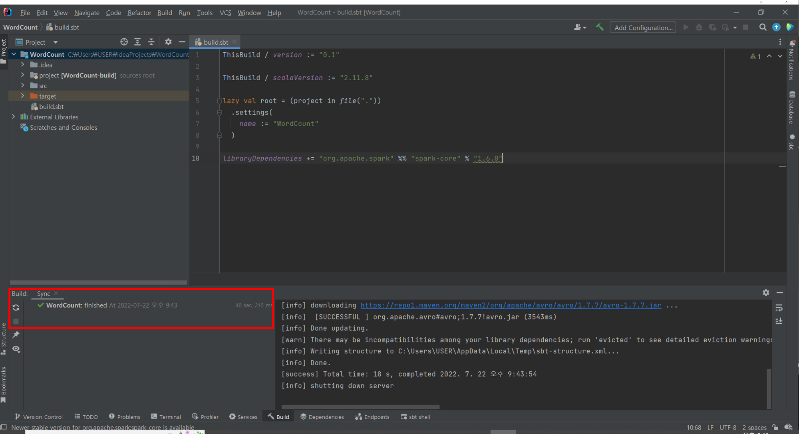

1. 좌측의 **Plugins** 메뉴에서 **Scala**를 검색하여 설치해 주십시오.

2. 플러그인을 반영하기 위해서는 재시작이 필요합니다. **\[Restart IDE\]** 버튼을 클릭하여 IntelliJ를 재시작해 주십시오.

3. 홈 화면 좌측 메뉴에서 **Projects**를 클릭한 후, **New Project**를 클릭해 주십시오.

4. 다음과 같이 **Scala**와 **sbt**를 선택한 후, **\[Create\]** 버튼을 클릭해 주십시오.
    - **Scala**와 **sbt** 버전을 선택
 
 
#### SBT 라이브러리 가져오기

IntelliJ가 Spark 코드를 인식하기 위해서는 spark-core 라이브러리와 문서를 가져와야 합니다.
> spark-core 라이브러리는 특정 버전의 Scala와 호환되기 때문에 라이브러리를 가져올 경우에는 spark-core와 Scala 버전을 각각 확인해 주십시오.

[mvn repository](https://mvnrepository.com/artifact/org.apache.spark/spark-core)에서 spark-core 라이브러리와 Artifact Id와 함께 호환되는 Scala 버전을 확인해 주십시오.

**Target > build.sbt**를 클릭한 후 스크립트 창에 아래와 같은 내용을 추가해 주십시오.
> libraryDependencies += "org.apache.spark" %% "spark-core" % "1.6.0"

라이브러리를 정상적으로 가져왔는지 Build 콘솔을 통해 확인해 주십시오.

