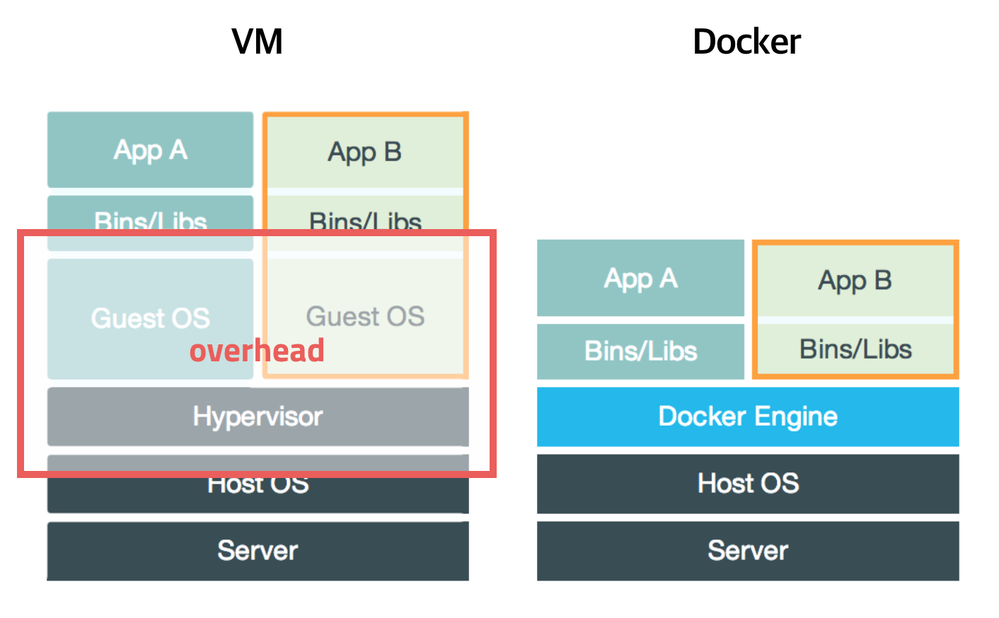
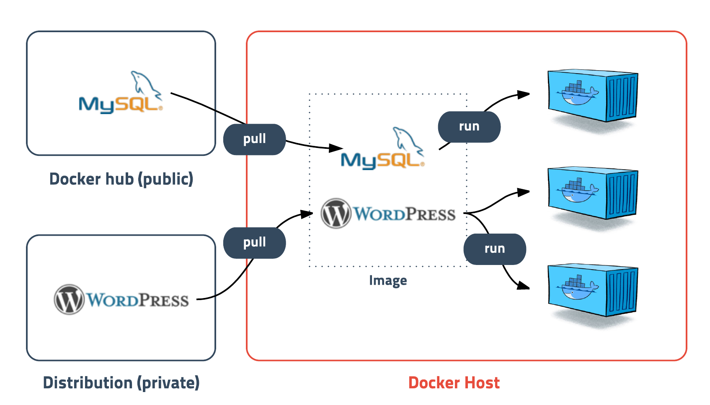
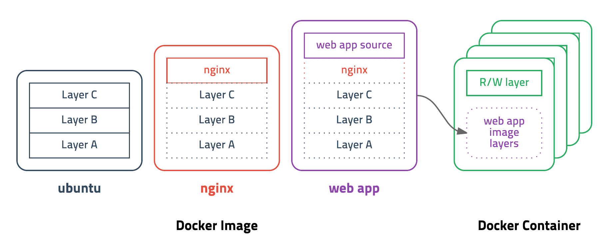

## 도커란?

도커는 **컨테이너 기반의 오픈소스 가상화 플랫폼**이다

컨네이너라 하면 배에 실는 네모난 화물 수송용 박스를 생각할 수 있는데 각각의 컨테이너 안에는 옷, 신발, 전자제품, 술, 과일등 다양한 화물을 넣을 수 있고 규격화되어 컨테이너선이나 트레일러등 다양한 운송수단으로 쉽게 옮길 수 있습니다.

서버에서 이야기하는 컨테이너도 이와 비슷한한데 다양한 프로그램, 실행환경을 컨테이너로 추상화하고 동일한 인터페이스를 제공하여 프로그램의 배포 및 관리를 단순하게 해준다. 백엔드 프로그램, 데이터베이스 서버, 메시지 큐등 어떤 프로그램도 컨테이너로 추상화할 수 있고 조립pc, AWS, Azure, Goggle cloud등 어디에서든 실행할수 있다

컨테이너를 가장 잘 사용하는 기업은 구글로, 구글은 모든 서비스들이 컨테이너로 동작하고 매주 20억 개의 컨테이너를 구동한다

#### 컨테이너(Container)

컨테이너는 격리된 공간에서 프로세스가 동작하는 기술이다. 가상화 기술의 하나지만 기존의 방식과는 차이가 있다

기존의 가상화 방식은 주로 **OS를 가상화**하였다

우리에게 익숙한 VMware, VirtualBox같은 가상머신은 호스트 OS위에 게스트 OS전체를 가상화하여 사용하는 방식이다 이방식은 여러가지 OS를 가상화(리눅스에서 윈도우를 돌리는 등)할 수 있고 비교적 사용법이 간단하지만 무겁고 느려서 운영환경에서는 사용할 수 없었다

이러한 상황을 개선하기 위해 CPU의 가상화 기술(HVM)을 이용한 KVM(Knrnel-based-Virtual Machine)과 반가상화(paravirtualization)방식의 Xen이 등장한다. 이러한 방식은 게스트 OS가 필요하긴 하지만 전체 OS를 가상화하는 방식이 아니였기에 호스트형 가상화 방식에 비해 성능이 향상되었다. 이러한 기술들은 OpenStack이나 AWS, Rackspace같은 클라우드 서비승서 가상 컴퓨팅 기술의 기반이 되었다



전가상화든 반가상화든 추가적인 OS를 설치하여 가상화하는 방법은 어쨋든 성능문제가 있었고 이를 개선하기 위해 **프로세스를 격리**하는 방식이 등장한다

리눅스에서는 이러한 방식을 **리눅스 컨테이너**라고 하고 단순히 프로세스를 격리 시키기 때문에 가볍고 빠르게 동작한다. CPU나 메모리는 딱 프로세스가 필요한 만큼만 추가로 사용하고 서능적으로도 거의 손실이 없다.

> 도커의 기본 네트워크 모드는 `Bride`모드로 약간의 성능 손실이있다. 네트워크 성능이 중요한 프로그램의 경우 `--net=host`옵션을 고려해야한다

하나의 서버에 여러개의 컨테이너를 실행하면 서로 영향을 미치지 않고 독립적으로 실행되어 마치 가벼운 VM(virtual machine)을 사용하는 느낌을 준다. 실행중인 컨테이너에 접속하여 명령어를 입력할 수 있고 `apt-get`이나 `yum`으로 패키지를 설치할 수 있으며 사용자도 추가하고 여러개의 프로세스를 백그라운드로 실행할 수도 있다. CPU나 메모리 사용량을 제한할 수 있고 호스트의 특정 포트와 연결하거나 호스트의 특정 디렉토리를 내부 디렉토리인 것처럼 사용할 수도 있다

새로운 컨테이너를 만드는데 걸리는 시간은 겨우 1~2초로 가상머신과 비교도 할 수  
없을만큼 빠르다

이러한 컨테이너란 개념은 도커가 처음만든것이 아니다. 도커가 등장하기 이전에, 프로세스를 격리하는 방법으로는 리눅스에서는 LXC가 있었고 FreeBSD에선 Jail등이 있었다. 구글에서는 기술자들이 직접 컨테이너 기술을 만들어 사용하였다

도커는 LXC를 기반으로 시작하여 0.9버전에서는 자체적인 libcontainer 기술을 사용하였고 추후 runC기술에 합쳐졌다



도커에서 가장 중요한 개념은 컨테이너와 이미지이다

이미지는 **컨테이너 실행에 필요한 파일과 설정값 등을 포함하고 있는 것**으로 상태값을 가지지 않고 변하지 않는다(immutable)

**컨네이너는 이미지를 실행한 상태**라고 볼 수 있고 추가되거나 변하지 않는 값은 컨테이너에 저장된다. 같은 이미지에서 여러개의 컨테이너를 생성할 수 있고 컨테이너의 상태가 바뀌거나 컨테이너가 삭제되더라도 이미지는 변하지않고 그대로 남아있다.

ubuntu이미지는 ubuntu를 실행하기 위한 모든 파일을 가지고있고 MySql이미지는 debian을 기반으로 MySql을 실행하는데 필요한 파일과 실행 명령어, 포트 정보등을 가지고 있다. 좀더 복잡한 예로 Gitlab이미지는 centos를 기반으로 ruby, go, database, rdeis, gitlab source, nginx등을 가지고 있다

말그대로 이미지는 컨테이너를 실해하기 위한 모~든 정보를 가지고 있기 때문에 더이상 의존성 파일을 컴파일하고 이것저것 설치할 필요가 없다. 이제 **새로운 서버가 추가되면 미리 만들어 놓은 이미지를 다운받고 컨테이너를 생성**만 하면 된다. 한 서버에 여러개의 컨테이너를 실행할 수 있고, 수십, 수백, 수천대의 서버도 문제가 없다.

도커이미지는 Docker hub에 등록하거나 Docker Registry저장소를 직접 만들어 관리할 수 있다. 현재 공개된 도커 이미지는 50만개가 넘고 Docker hub의 이미지 다운로드수는 80억회에 이른다. 누구나 쉽게 이미지를 만들고 배포가 가능하다

## 차별성

도커는 완전히 새로운 기술이 아니며 이미 존재하는 기술을 잘 포장했다고 볼수 있다

컨테이너, 오버레이 네트워크, 유니온 파일 시스템 등 이미 존재하는 기술을 도커처럼 잘 조합하고 사용하기 쉽게 만든것은 없었고 사용자들이 원하는 기능을 간단하지만 획기적인 아이디어로 구현했다

#### 레이어 저장 방식



도커 이미지는 컨테이너를 실행하기 위한 모든 정보를 가지고 있기 때문에 보통 용량이 수백메가에 이른다. 처음 이미지를 다운받을 땐 크게 부담이 안되지만 기존 이미지에 파일하 추가했다고 수백메가를 다시 다운받는다면 매우 비효율적일 수 밖에 없다

도커는 이런 문제를 해결하기 위해 레이어(layer)라는 개념을 사용하고 유니온 파일 시스템을 이용하여 여러개의 레이어를 하나의 파일 시스템으로 사용할 수 있게 해준다. 이미지는 여러개의 읽기 전용 레이어로 구성되고 파일이 추가되거나 수정되면 새로운 레이어가 생성된다. ubuntu이미지가 `A`+`B`+`C`의 집합이라면, ubuntu 이미지를 베이스로 만든 nginx이지미는 `A`+`B`+`C` + `nginx`가 된다. webapp이미지를 nginx기반으로 만들었다면 예상 가능한 `A`+`B`+`C` + `nginx` + `source` 레이어로 구성된다. webapp소스를 수정하면 `A`,`B`,`C` ,`nginx` 레이러를 제외한 새로운 `source(v2)`레이어만 다운받으면 되므로 매우 효율적으로 이미지를 관리할 수 있다

컨테이너를 생성할 때도 레이어 방식을 사용하는데 기존의 이미지 레이어 위에 읽기/쓰기 레이어를 추가한다. 이미지 레이어를 그대로 사용하면서 \+ 컨테이너가 실행중에 생성하는 파일이나 변경된 내용을 읽기/쓰기 레이어에 저장되므로 여러개의 컨테이너를 생성해도 최소한의 용량만을 사용한다

가상화의 특성상 이미지의 용량이 크고 여러대의 서버에 배포하는걸 감안하면 단순하지만 엄청나게 영리한 설계이다

#### 이미지 경로


이미지는 url방식으로 관리하며 태그를 붙일 수 있다. ubuntu 14.04 이미지는 `docker.io/library/ubuntu:14.04`또는 `docker.io/library/ubunty:trusty`이고 `docker.io/library`는 생략가능하여 `ubuntu:14.04`로 사용할 수 있다. 이러한 방식은 이해하기도 쉽고 편리하게 사용할 수 있으며 태그기능을 잘 이용하면 테스트나 롤백도 쉽게 할수 있다

#### 도커파일 Dockerfile
```docker
# vertx/vertx3 debian version
FROM subicura/vertx3:3.3.1
MAINTAINER chungsub.kim@purpleworks.co.kr

ADD build/distributions/app-3.3.1.tar /
ADD config.template.json /app-3.3.1/bin/config.json
ADD docker/script/start.sh /usr/local/bin/
RUN ln -s /usr/local/bin/start.sh /start.sh

EXPOSE 8080
EXPOSE 7000

CMD ["start.sh"]
```
도커는 이미지를 만들기 위해 `Dockerfile`이라는 파일에 자체 DSL(Domain-specific-language)언어를 이용하여 이미지 생성 과정을 적는다. 추후에 문법에 대해 자세히 다루겠지만 위 샘플을 보면 그렇게 복잡하지 않다는 것을 알수 있다.