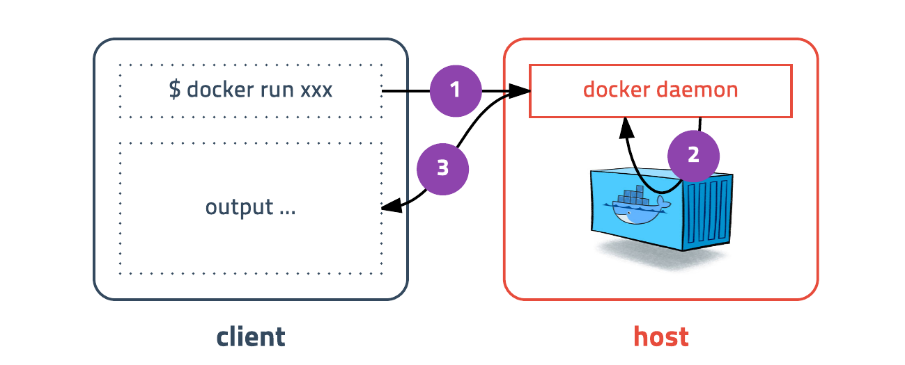

## 도커 설치하기

기본적으로 도커는 리눅스 컨테이너 기술이므로 macOs, Windows에 설치할 경우 가상머신에 설치가 된다

도커는 하나의 실행파일이지만 실제로 클라이언트와 서버 역활을 각각 할수 있다. 도커 커맨드를 입력하면 도커 클라이언트가 도커 서버로 명령을 전송하고 결과를 받아 터미널에 출력해 준다.

## 컨테이너 실행하기

도커를 실행하는 명령어

> docker run [OPTIONS] IMAGE[:TAG|@DIGEST][COMMAND] [ARG...]

다음은 자주 사용하는 옵션
 
-d : detached mode 흔히 말하는 백그라운드 모드  
-p : 호스트와 컨테이너의 포트를 연결 (포워딩)  
-v : 호스트와 컨테이너의 디렉토리를 연결 (마운트)  
-e : 컨테이너 내에서 사용할 환경변수 설정  
–name : 컨테이너 이름 설정  
–rm : 프로세스 종료시 컨테이너 자동 제거  
-it : -i와 -t를 동시에 사용한 것으로 터미널 입력을 위한 옵션  
–link : 컨테이너 연결 \[컨테이너명:별칭\]

#### ubuntu 16.04 container

ubuntu 16.04컨테이너를 생성하고 컨테이너 내부로 들어가보기

명령어 `docker run ubuntu:16.04`

`run`명령어를 사용하면 사용할 이미지가 저장되어 있는지 확인하고 없다면 다운로드(`pull`)를 한 후 컨테이너를 생성(`create`)하고 시작(`start`)한다

ubuntu:16.04 이미지를 다운받은 적이 없기 때문에 이미지를 다운로드 한 후 컨테이너가 실행되고. 컨테이너는 정상적으로 실행됐지만 뭘 하라고 명령어를 전달하지 않았기 때문에 컨테이너는 생성되자마자 종료된다. 컨테이너는 프로세스이기 때문에 실행중인 프로세스가 없으면 컨테이너는 종료된다.

명령어 `docker run --rm -it ubuntu:16.04 /bin/bash`

`\bin\bash`명령어를 입력하여 `ubuntu:16.04`컨테이너를 실행

컨테이너 내부에 들어가기 위해 bash쉘을 실행하고 키보드 입력을 위해 `-it`옵션을 준다. 추가적으로 프로세스가 종료되면 컨테이너가 자동으로 삭제되도록 `--rm`옵션도 추가하였다.

이전 명령어에서 이미지를 다운받았으므로 다운로드없이 바로 실행된다.

도커를 이용하여 가장 기본적인 컨테이너를 만드는 과정이였다

## 도커의 기본 명령어

도커의 run명령어를 이용하여 여러개의 컨테이너를 실행해보았다. 이제 컨테이너의 상태를 살펴보고 어떤 이미지가 설치되어 있는지 확인하는 명령어를 알아보자

#### 컨테이너 목록 확인하기 : ps

컨테이너 목록을 확인하는 명령어이다
> docker ps \[options\]

ps명령어는 실행중인 컨테이너 목록을 보여준다. detached mode로 실행중인 컨테이너들이 보인다. 어떤 이미지를 기반으로 만들었는지, 어떤 포트와 연결이 되어있는지 등 간단한 내용을 보여준다

> docker ps -a
처음 실행했다가 종료된 컨테이너(exited)가 추가로 보여진다. 컨테이너는 종료되어도 삭제되지 않고 남아있는다. 종료된건 다시 시작할 수 있고 컨테이너의 읽기/쓰기 레이어는 그대로 존재한다. 명시적으로 삭제를 하면 깔끔하게 컨테이너가 제거된다

#### 컨테이너 중지하기 : stop

실행중인 컨테이너를 중지하는 명령어이다
> docker stop \[options\] CONTAINER \[CONTAINER...\]

옵션은 특별한게 없고 실행중인 컨테이너를 하나 또는 여러개(띄어쓰기로 구분)를 중지할 수 있다.

앞에서 실행한 ubuntu:16.04 컨테이너를 중지해보자. 중지하려면 컨테이너의 ID또는 이름을 입력하면 된다. ubuntu:16.04 컨테이너의 id를 ps명령어를 통해 확인하고 중지하자

>도커 ID의 전체 길이는 64자리 입니다. 하지만 명령어의 인자로 전달할 때는 전부 입력하지 않아도 됩니다. 예를 들어 ID가 abcdefgh...라면 abcd만 입력해도 됩니다. 앞부분이 겹치지 않는다면 1-2자만 입력해도 됩니다.

#### 컨테이너 제거하기 : rm
#### 이미지 목록 확인하기 : images
#### 이미지 다운로드하기 : pull
#### 이미지 삭제하기 : rmi
