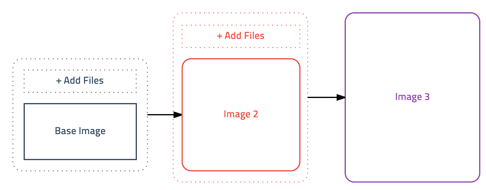

# 이미지 만들고 배포하기

## 도커 이미지 만들기

도커는 이미지를 만들기 위해 **컨테이너의 상태를 그대로 이미지로 저장**하는 단순한 방법을 사용한다

예를 들어, 어떤 어플리케이션을 이미지로 만든다면 리눅스만 설치된 컨테이너에 어플리케이션을 설치하고 그 상태를 그대로 이미지로 저장한다. 가상머신의 스냅샷과 비슷한 방식이다

이런 과정은 콘솔에서 명령어를 직접 입력하는 것과 별 차이가 없으므로 쉘 스크립트를 잘아야하지만 좋은 샘플이 많이 공개되어있어 잘 몰라도 크게 걱정하지 않아도된다. 또한 컨테이너의 가벼운 특성과 레이어 개념을 이용하여 생성과 테스트를 빠르게 수행할 수 있다.