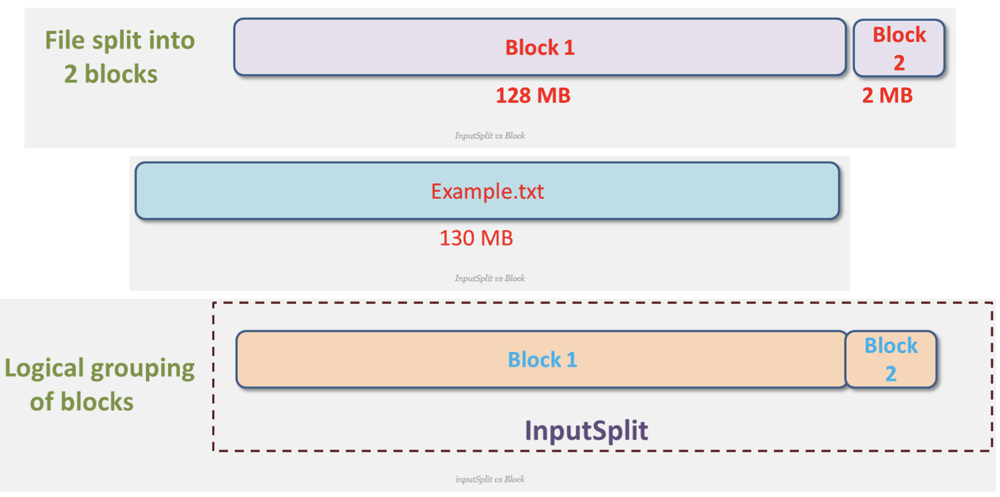
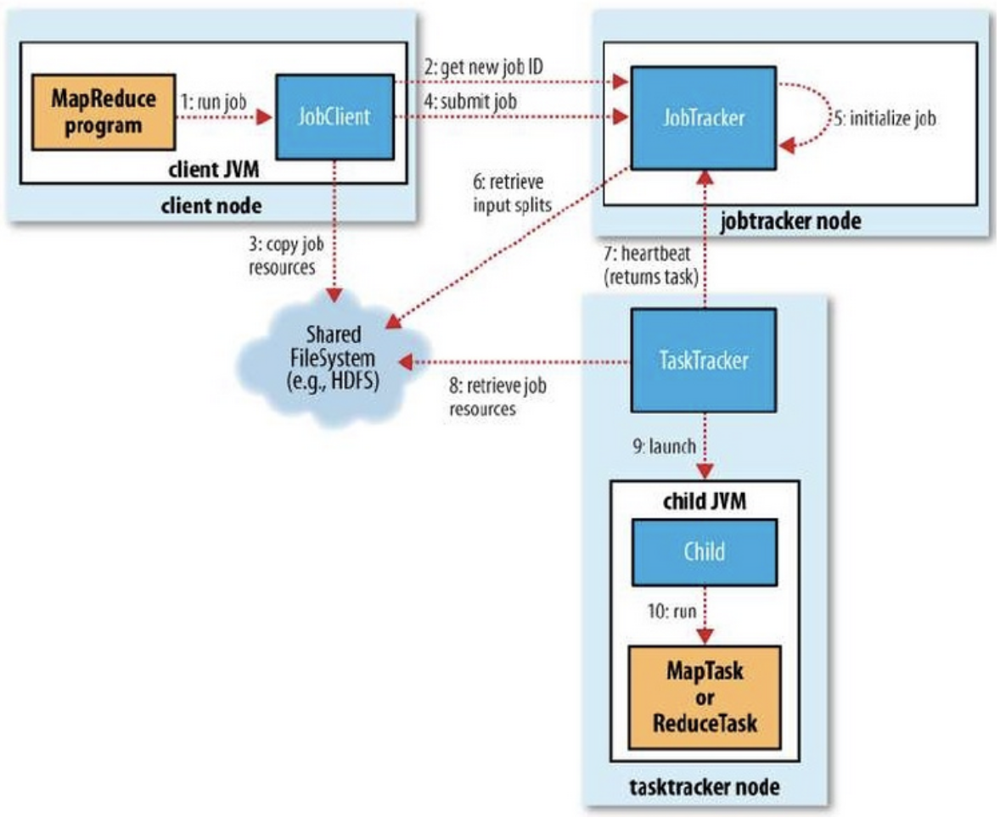

### ### 맵리듀스(MapReduce)란?

- 2004년 구글에서 발표한 Lage Cluster에서 Data Processing을 하기 위한 알고리즘
- Hadoop MapReduce는 구글 알고리즘 논문을 소프트웨어 프레임워크로 구현한 구현체
- Key-Value구조가 알고리즘의 핵심
- 모든 문제를 해결하기에 적합하지 않을 수 있다 (데이터의 분산 처리가 가능한 연산에 적합하다)
####  맵리듀스 알고리즘
- Map Function
    - (key1, value1) -> (key2, value2)
- Reduce Function
    - (key2, List of value2) -> (key3, value3)
key와 value로 이뤄진 값을 넣으면 Key-value의 값이 나오는 형태이다
- HDFS에 분산 저장되어 있는 데이터를 병렬로 처리하여 취합하는 역활
- Map Function과 Reduce Fucntion으로 구성
- java, c++, pyton 등 다양한 언어 지원
- Job에 대한 구동 및 관리는 하둡이 알아서 한다, 개발자는 비지니스 로직 구현에 집중

#### 맵리듀스 장단점
**장점**
- 단순하고 사용이 편리하다
- 높은 확장성
- 특정 데이터 모델이나 스키마, 질의에 의존적이지 않은 유연성
- 저장 구조의 독립성
- 데이터 복제에 기반한 내구성과 재수행을 통한 내고장성 확보

**단점**
- 고정된 단일 데이터 흐름
- 기존 DBMS보다 불편한 스키마 질의
- 단순한 스케쥴링
- 작인 데이터를 저장/처리하기에 적합하지 않다.

#### 맵리듀스 구동 방식
- Local
단일 JVM에서 전체 Job을 실행하는 방식으로 로컬상에서 테스트하는 환경
- Classic
Hadoop 버전 1.0대. Job Tracker 와 Task Tracker 사용하는 맵리듀스 버전1
- YARN
Hadoop 버전 2.0↑. 맵리듀스 이외의 워크로드 수용이 가능한 맵리듀스 버전2

#### MapReduce 1
- Client
구현된 맵리듀스 Job을 제출하는 실행 주체
- Job Tracker
맵리듀스 Job이 수행되는 전체 과정을 조성하며, Job에 대해 수행하는 마스터 데몬 역할
- Task Tracker
Job에 대한 분할된 Task를 수행하며, 실질적인 Data Processing의 주체이다. n개의 서버로 구성돼있는 slave에 떠있는 Job을 수행하는 데몬
- HDFS
각 단계들 간의 Data와 처리과정에서 발생하는 중간 파일들을 공유하기 위해 사용,=. HDFS에 저장되어있는 파일을 처리하기 위해 사용

#### InputSplits
물리적 Block들을 논리적으로 그룹핑

- 하둡은 저장할 파일을 128mb 블록들로 쪼개서 관리하게 되는데 inputSplits가 쪼개진 물리적 블록들을 논리적으로 그룹핑하는 것이다
- inputSplit은 Mapper의 입력으로 들어오는 데이터를 분할하는 방식을 제공하기 위해 데이터의 위치와 읽어 들이는 길이를 정의한다.

#### 구동 절차

자바 프로그램으로 애플리케이션을 만들었다고 가정시

클라이언트가 하둡 Job Tracker한테 앱의 실행할 자료파일을 제출한다. 
Job Tracker는 전달 받은 자료파일을 HDFS에 저장을 한다. 
이렇게 되면 모든 DataNode에서는 HDFS에 접근이 가능하므로 해당 파일을 가져오고 모든 Task Tracker가 해당파일을 참조를 하고 child JVM이 fork되고 Map Task 또는 Reduce Task가 실행이 된다
1.  Job 실행
2.  신규 Job ID할당(JobTracker) 및 수신
3.  Job Resource 공유
4.  Job 제출
5.  Job 초기화
6.  InputSplits 정보 검색
7.  TaskTracker에 Task를 할당
8.  TaskTracker가 공유되어 있는 Job Resource를 Local로 복사
9.  TaskTracker가 child JVM 실행
10. MapTasker or ReduceTaks 실행

