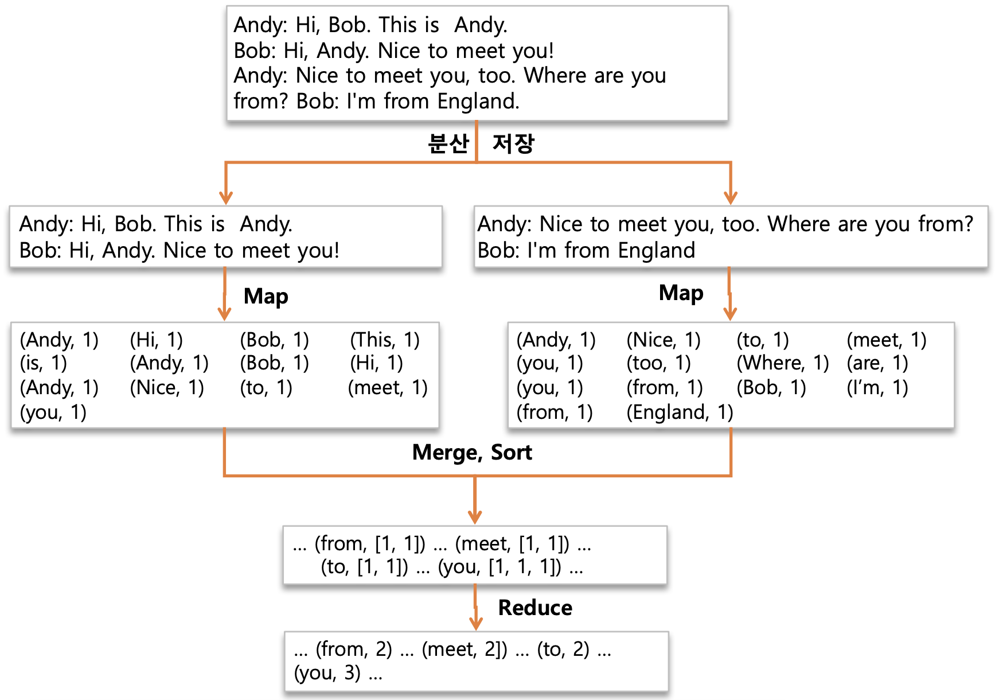

### ### 맵리듀스(MapReduce)란?

- 2004년 구글에서 발표한 Lage Cluster에서 Data Processing을 하기 위한 알고리즘
- Hadoop MapReduce는 구글 알고리즘 논문을 소프트웨어 프레임워크로 구현한 구현체
- Key-Value구조가 알고리즘의 핵심
- 모든 문제를 해결하기에 적합하지 않을 수 있다 (데이터의 분산 처리가 가능한 연산에 적합하다)
####  맵리듀스 알고리즘
- Map Function
    - (key1, value1) -> (key2, value2)
- Reduce Function
    - (key2, List of value2) -> (key3, value3)
key와 value로 이뤄진 값을 넣으면 Key-value의 값이 나오는 형태이다
- HDFS에 분산 저장되어 있는 데이터를 병렬로 처리하여 취합하는 역활
- Map Function과 Reduce Fucntion으로 구성
- java, c++, pyton 등 다양한 언어 지원
- Job에 대한 구동 및 관리는 하둡이 알아서 한다, 개발자는 비지니스 로직 구현에 집중

#### 맵리듀스 장단점
**장점**
- 단순하고 사용이 편리하다
- 높은 확장성
- 특정 데이터 모델이나 스키마, 질의에 의존적이지 않은 유연성
- 저장 구조의 독립성
- 데이터 복제에 기반한 내구성과 재수행을 통한 내고장성 확보

**단점**
- 고정된 단일 데이터 흐름
- 기존 DBMS보다 불편한 스키마 질의
- 단순한 스케쥴링
- 작인 데이터를 저장/처리하기에 적합하지 않다.

#### 맵리듀스 구동 방식
- Local
단일 JVM에서 전체 Job을 실행하는 방식으로 로컬상에서 테스트하는 환경
- Classic
Hadoop 버전 1.0대. Job Tracker 와 Task Tracker 사용하는 맵리듀스 버전1
- YARN
Hadoop 버전 2.0↑. 맵리듀스 이외의 워크로드 수용이 가능한 맵리듀스 버전2

#### MapReduce 1
- Client
구현된 맵리듀스 Job을 제출하는 실행 주체
- Job Tracker
맵리듀스 Job이 수행되는 전체 과정을 조성하며, Job에 대해 수행하는 마스터 데몬 역할
- Task Tracker
Job에 대한 분할된 Task를 수행하며, 실질적인 Data Processing의 주체이다. n개의 서버로 구성돼있는 slave에 떠있는 Job을 수행하는 데몬
- HDFS
각 단계들 간의 Data와 처리과정에서 발생하는 중간 파일들을 공유하기 위해 사용,=. HDFS에 저장되어있는 파일을 처리하기 위해 사용

#### InputSplits
물리적 Block들을 논리적으로 그룹핑

- 하둡은 저장할 파일을 128mb 블록들로 쪼개서 관리하게 되는데 inputSplits가 쪼개진 물리적 블록들을 논리적으로 그룹핑하는 것이다
- inputSplit은 Mapper의 입력으로 들어오는 데이터를 분할하는 방식을 제공하기 위해 데이터의 위치와 읽어 들이는 길이를 정의한다.

#### 구동 절차

자바 프로그램으로 애플리케이션을 만들었다고 가정시

클라이언트가 하둡 Job Tracker한테 앱의 실행할 자료파일을 제출한다. 
Job Tracker는 전달 받은 자료파일을 HDFS에 저장을 한다. 
이렇게 되면 모든 DataNode에서는 HDFS에 접근이 가능하므로 해당 파일을 가져오고 모든 Task Tracker가 해당파일을 참조를 하고 child JVM이 fork되고 Map Task 또는 Reduce Task가 실행이 된다
1.  Job 실행
2.  신규 Job ID할당(JobTracker) 및 수신
3.  Job Resource 공유
4.  Job 제출
5.  Job 초기화
6.  InputSplits 정보 검색
7.  TaskTracker에 Task를 할당
8.  TaskTracker가 공유되어 있는 Job Resource를 Local로 복사
9.  TaskTracker가 child JVM 실행
10. MapTasker or ReduceTaks 실행

#### 제출 과정

job의 submit 메소드

* jobTracker에 새로운 job id를 요청
* job에 대한 입력 스플릿(inputSplits)를 계산 -> Data locality 고려
* job 수행에 필요한 자원(resource)을 JobTracker의 파일 시스템 (HDFS)상의 해당 job ID를 이름으로 하는 디렉토리에 복사 (jar 설정파일, inputSplits 정보)
    * 모든 TaskTracker가 리소스를 로컬로 복사 (Localization 과정)
* job Tracker가 job을 시작할 준비가 되었음을 알림

**job Initialization (초기화)**

* `Job Tracker`가 `submitJob 메소드`의 호출을 받으면 Job을 내부 Queue에 저장
    
* **Job Scheduler**는 Queue에서 Job을 읽어서 **초기화 과정을 진행**
    
    * 실행할 job을 표현하기 위해 하나의 객체를 생성
    * 이 객체는 job에 대한 task뿐만 아니라 상태 및 진행 과정을 유지하기 위한 부가 정보를 캡슐화

**초기화 과정**

* 공유파일시스템 (HDFS)으로부터 계산된 `입력 스플릿 정보`를 가져온다
* 각 InputSplit에 대해 하나의 MapTask를 생성
* `mapred.reduce.tasks` 속성 값에 따라 이 수 만큼 Reduce Task를 생성

**Task 할당**

* TaskTracker는 하트비트를 보내는 단순한 루프를 수행
    
* 하트비트는 Live 상태 체크 및 메시지 채널 용도로 사용된다
    
    * 하트비트를 보낼 때 정보의 일부로 task를 수행할 준비가 되었는지 여부를 전달
    * jobTracker가 하트비트의 응답으로 할당된 task를 전달
* TaskTracker는 map 및 Reduce Task를 위한 많은 수의 혼합된 슬롯을 갖는다
    
* JobTracker의 TaskTracker 선택기준
    
    * Reduce Task는 순차적으로 선택된다
    * TaskTracker는 지역성을 계산하여서, 가까운 거리에 있는 InputSplit을 갖도록 선택한다

**Task 실행**

* Job의 구현체 jar파일을 공유된 HDFS로 부터 로컬파일 시스템으로 복사
* 분산 캐시로부터 필요한 모든 파일을 로컬 파일 시스템으로 복사
* Task 실행을 위한 Local Job Directory를 생성하고 jar 압축 해체
* TaskRunner Instance를 생성하여 Task를 수행

### 맵리듀스 데이터 처리 흐름

로컬 디스크에서 가장 처음 뜨는 Task가 Map Task이다

split되어있는 자료들을 Map Task에서 읽어서 맵리듀스 알고리즘 상의 알고리즘으로 처리를 해서 output을 주고, 반환된 output결과를 hash partitioning을 하고, 파티션 기준으로 같은 key를 갖고 있는 데이터들 끼리 모아서 merge 작업을 해주고 Reduce연산을 해준 후 최종 output을 내놓는다

위 내용을 그림상으로 표현해보면

이와 같은 형태로 진행이 되는 것이다

만약 맨 위의 text파일이 100기가 크기의 파일이라 하면 해당 파일은 128mb의 크기로 수많은 블록단위로 쪼개져서 분산 저장하게 된다, 이때 MapTask는 각 블록마다 하나씩 뜨게 된다

쪼개진 블록단위 텍스트 파일에 대해서 맵리듀스 애플리케이션을 적용하려 하는데 해당 앱은 전체 텍스트에서 각 단어가 몇번 나왔는지 세는 앱이라 가정

그러면 해당 맵리듀스 앱은 각 블록에서 MapTask를 key-value의 쌍으로 구현을 하고 각 블록에서 먼저 값들을 정리를 하고

정리된 블록에 대해서 key를 기준으로 같은 key를 가지고 있는 것들끼리 서버에 모으게 된다. 이때 MapTask를 수행한 서버와 Reduce를 수행한 서버끼리 트래픽이 발생하게 된다

### 맵리듀스 구현을 위한 Interface

Input

* 데이터를 읽을 때 어떠한 형태의 데이터를 읽을지
* 텍스트, 이미지 등
* 읽는 데이터 형식에 맞는 inputFormater들이 기본적으로 만들어져서 제공되거나, 직접 구현해서 사용할 수 있다

Mapper

* 실제 첫번째 비지니스 로직을 key-value형태로 구현

combiner

* 추후 설명

partitioner

* mapper에 나온 키들을 파티셔닝
* 키를 기준으로 서로 다른 노드에서 나온 키들을 같은 키끼리 묶을수 있도록 같은 서버로 전송을 해주고

Reducer

* 모든 서버들의 내용을 취합해서 원하는 출력을 만들고

output

* 출력을 해준다

Mapper에서 Reducer로 보내는 과정속에  
shuffle이라하는데, 같은 키를 같고있는 애들끼리 모으고 sorting 후에 reducer의 입력값으로 들어가게 된다  
이때, shuffle과정에서 트래픽이 발생할 수 밖에 없다

이 트래픽을 줄이는데 중요한 역활을 하는것이 **combiner**와 **partitioner**이다

### InputFormat 종류
![inputformat 종류]](Scala 언어 학습/asset/c179eb6dc75314b28fa2b9d248c095d9.png)

Mapper의 output결과를 보통 sequenceFile로 쓴다

**SequenceFile 이란?**

* sequence file은 하둡 자체적으로 구현된 binary파일 포맷으로 key-value 쌍으로 구성되어있다

### Combiner의 역할

Mapper 다음에 추가되어 있는 모습이다

데이터 전송량을 줄이기 위해서 미리 mapper내부에서 정보를 취합을 해서 Reducer로 전송할 트래픽양을 줄여준다

### Partitioner의 역할

