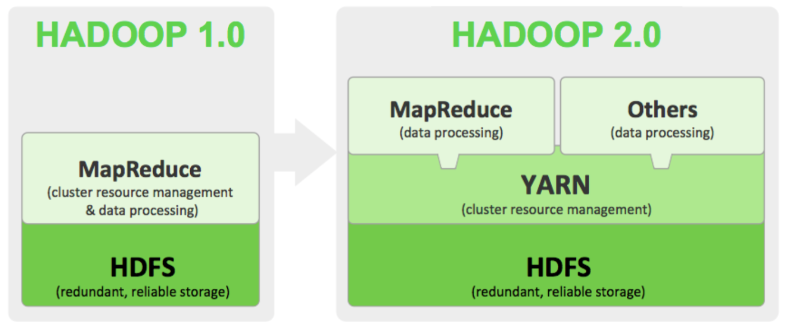
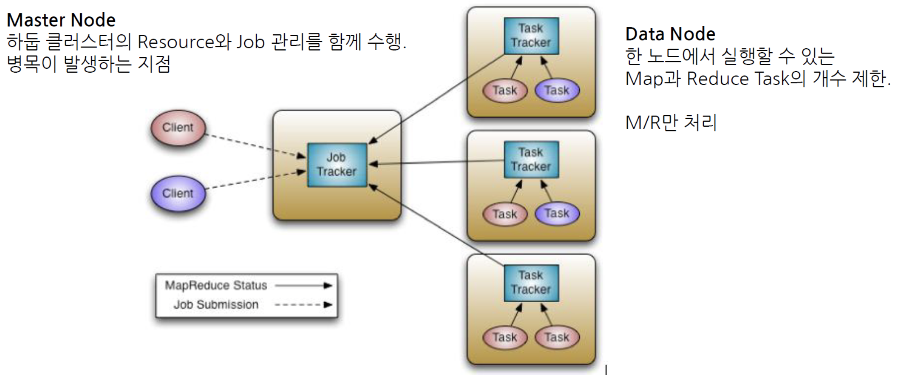
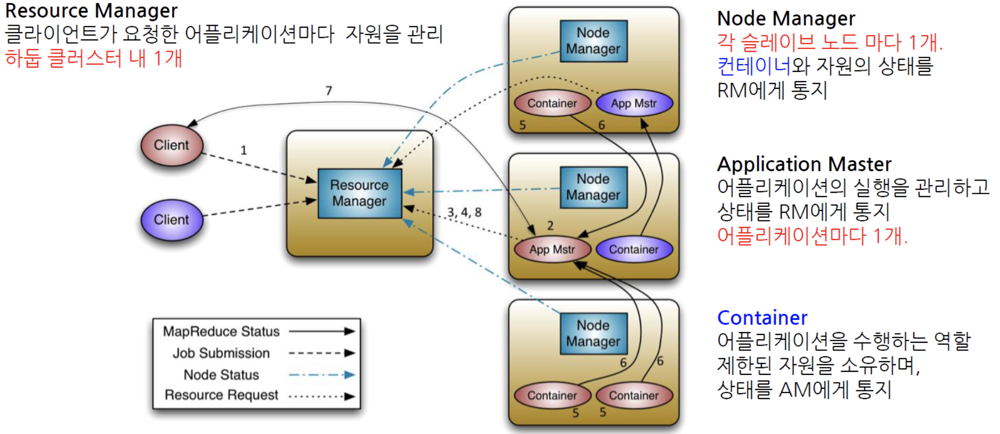

## MapReduce 2

**기존에 맵리듀스에서 자원관리와 데이터 처리를 같이하던 것**에서 **YARN에게 클러스터의 자원 관리**를 맡기고 **맵리듀스는 데이터 처리**를 하도록 분할 하였다. 또한 맵리듀스 이외의 다른 Data Processing 방식도 수용가능한 아키텍쳐로 변경되었다

기존 맵리듀스1에서는 4000노드 이상의 매우 큰 클러스터에서 동작 시 병목현상 이슈가 발생했다 - JobTracker에 발생

확장성 문제를 해결하기 위해 JobTracker의 책임을 여러 컴포넌트로 분리

* ResourceManager : 클러스터의 컴퓨팅 리소스 를 관리
* ApplicationMaster : 클러스터에서 실행중인 Job의 LifeCycle을 관리
* NodeManager : 컨테이너를 모니터링하고, Job이 할당 받은 그 이상의 리소스가 사용되지 않도록 보장

### 기존 1.0 맵리듀스

### 변경된 2.0 맵리듀스

모든 노드에 NodeManger가 존재한다

클라이언트가 어떤 애플리케이션을 만들어서 Job을 submit을 하게 되면 ResourceManager가 전체 클러스터의 리소스를 주기적으로 리포트를 받다가 `Application Master`를 2번 서버에 실행을 하겠다고 2번 NodeManager에게 명령을 내리면 2번 NodeManager가 평소에는 존재하지 않다가 Application Master를 구동을 하는 방식이다

여기서 구동되는 Application Master가 1.0의 Job Tracker와 유사한 개념이다

Application Master가 Container에 명령을 내리게 된다. 이 Container가 1.0의 TaskTracker와 유사하다

상대적으로 복잡하기 때문에 Job Initialize에 걸리는 시간이 10~30초 정도 소요되므로 아무리 간단한 작업이라 할지라도 기본 세팅 시간이 오래잡아먹는다. 따라서 대규모의 데이터 처리에 적합한 시스템이다
