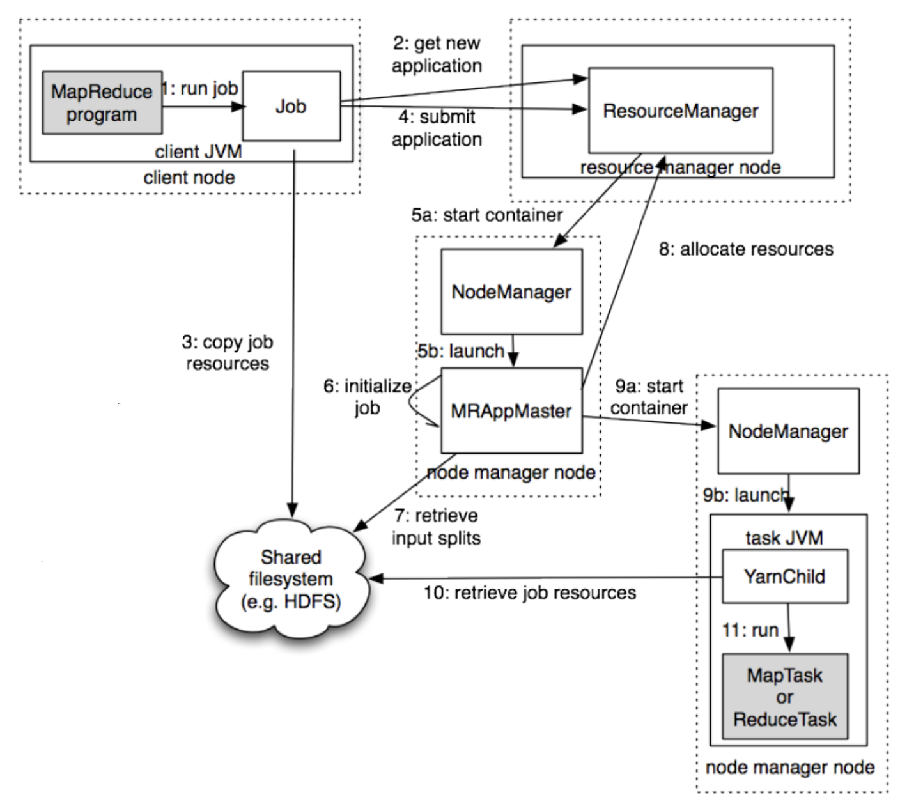
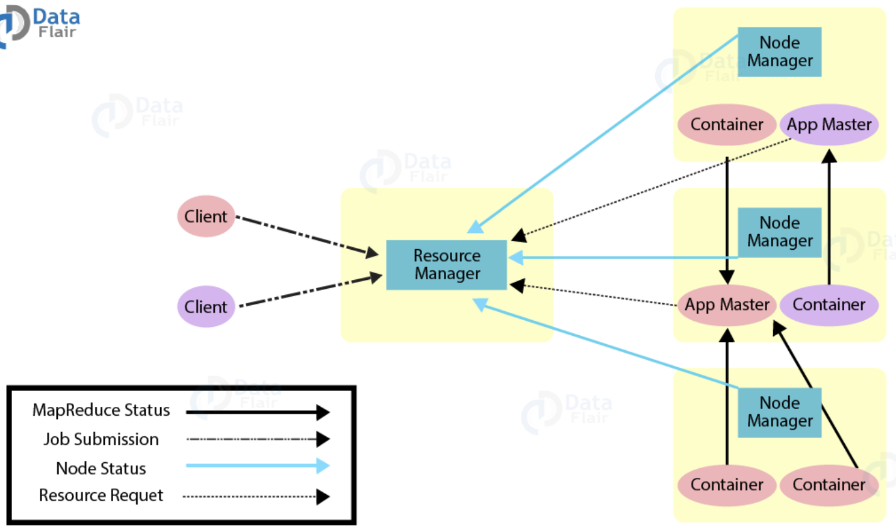

## MapReduce 2

**기존에 맵리듀스에서 자원관리와 데이터 처리를 같이하던 것**에서 **YARN에게 클러스터의 자원 관리**를 맡기고 **맵리듀스는 데이터 처리**를 하도록 분할 하였다. 또한 맵리듀스 이외의 다른 Data Processing 방식도 수용가능한 아키텍쳐로 변경되었다

기존 맵리듀스1에서는 4000노드 이상의 매우 큰 클러스터에서 동작 시 병목현상 이슈가 발생했다 - JobTracker에 발생

확장성 문제를 해결하기 위해 JobTracker의 책임을 여러 컴포넌트로 분리

* ResourceManager : 클러스터의 컴퓨팅 리소스 를 관리
* ApplicationMaster : 클러스터에서 실행중인 Job의 LifeCycle을 관리
* NodeManager : 컨테이너를 모니터링하고, Job이 할당 받은 그 이상의 리소스가 사용되지 않도록 보장

### 기존 1.0 맵리듀스

### 변경된 2.0 맵리듀스

모든 노드에 NodeManger가 존재한다

클라이언트가 어떤 애플리케이션을 만들어서 Job을 submit을 하게 되면 ResourceManager가 전체 클러스터의 리소스를 주기적으로 리포트를 받다가 `Application Master`를 2번 서버에 실행을 하겠다고 2번 NodeManager에게 명령을 내리면 2번 NodeManager가 평소에는 존재하지 않다가 Application Master를 구동을 하는 방식이다

여기서 구동되는 Application Master가 1.0의 Job Tracker와 유사한 개념이다

Application Master가 Container에 명령을 내리게 된다. 이 Container가 1.0의 TaskTracker와 유사하다

상대적으로 복잡하기 때문에 Job Initialize에 걸리는 시간이 10~30초 정도 소요되므로 아무리 간단한 작업이라 할지라도 기본 세팅 시간이 오래잡아먹는다. 따라서 대규모의 데이터 처리에 적합한 시스템이다

### YARN 맵리듀스 동작 흐름

RM : 리소스 매니저  
NM : 노드 매니저  
AM : 애플리케이션 마스터

1.  클라가 RM에게 애플리케이션 제출
2.  NM를 통해 AM 실행
3.  AM는 RM에게 자신을 등록
4.  AM는 RM에게 컨테이너 할당할 공간/위치를 받는다
5.  AM는 NM에게 컨테이너의 실행을 요청
    * 앱 정보를 NM에게 제공
6.  컨테이너는 앱의 상태정보를 AM에게 알린다
7.  클라는 앱의 실행정보를 얻기 위해 AM와 직접 통신
8.  앱이 종료되면 AM는 RM에게서 자신의 자원을 해제하고 종료

### 요청 흐름도

Container들이 앱 마스터에게 맵리듀스 상태정보 제공  
클라가 RM에게 jop제출  
Node Manager들이 RM에게 상태 항시 전송  
AM가 RM에게 자원(리소스) 요청

YARN 맵리듀스

* Job 제출
* Job 초기화(Initialization)
* Task 할당
* Task 실행

YARN에서는 진행상황과 상태정보를 Application Master에게 보고한다
클라이언트는 진행상황의 변화를 확인하기 위해 매초마다 AM을 조회

## 하둡에 적합하지 않은 것

* 크지않은 데이터에 하둡을 적용하는것은 오히려 느리므로 적합하지 않다
* 파일사이즈가 기본적으로 크게 해서 관리하는것이 좋다. 작은 파일들이 여러개로 저장되있는것이 더 안좋다
    * 헤르 라는 압축유형이 존재하는데, 작은 파일들을 헤르로 모아서 압축을 해서 보통 관리를 한다
* 데이터 파일이 1kb등의 수천파일들이 존재할 수 있는데 이를 하둡에서 잘 관리하기 위해서 combine format이 존재하므로 이를 이용하면 적합하다
* MapReduce는 프로그래밍 레벨등의 개발이 필요하다 (java, python, c++)
* 더 쉬운 분석 지원을 위해 SQL을 지원하는 쿼리 엔진이 필요하다
    * Hive, Apache Spark SQL  
        (하둡에 저장되 있는 데이터를 sql 배치로 던질수 있다, Rdd 구조를 가지고 메모리상에서 처리하므로 속도가 매우 빠르다, 단 메모리 공간에서 처리하므로 메모리 이상의 너무 큰 파일은 처리가 힘드므로 Hive에서 처리를 해야한다)  
        일반적으로는 스파크가 더빠르고 메모리 이내의 사이즈일 경우에 대부분 스파크를 이용

### Hive

* 하둡에 저장된 데이터를 쉽게 처리할 수 있는 데이터 웨어하우스 패키지
* FaceBook에서 매일같이 생산되는 대량의 데이터를 관리하고 학습하기 위해 개발
* SQL과 유사한 Query Lang을 지원
* SQL레벨의 ETL 처리도구로 활용가능
* 작성된 쿼리를 내부적으로 MapReduce 형태로 변환

### apache Spark

* 머신러닝, 실시간 분석, SQL 쿼리 분석, 그래프 처리 등 다양한 곳에 이용이 가능하다
* 메모리 기반 분산 처리라 Hive보다 3배가량 빠르다