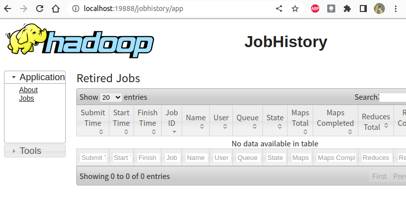

### VMWare - ubunto 환경에서 설명합니다.
---
### Hadoop 설치 (Standalone 모드, 코딩 및 디버깅용)
- Console 실행
	- Applications > Accessories > Terminal
- 스켈레톤 프로젝트 다운로드 후 Project 폴더 확인
```linux
$ sudo chown -R hadoop:hadoop Project
$ cd Project
$ sudo mv hadoop-3.2.2 /usr/local/hadoop
$ sudo apt update
$ sudo apt install ssh openjdk-8-jdk ant -y
$ ./set_hadoop_env.sh
$ source ~/.bashrc
```
---
### Hadoop 실행을 위한 준비
- **hadoop** 계정으로 실행
- 비어있는 `ssh key` 생성
	- `$ ssh-keygen -t rsa -P ""`
	-  저장할 파일을 물어본다면 default로 enter
- `$ cat $HOME/.ssh/id_rsa.pub >> $HOME/.ssh/authorized_keys`
- 제대로 생성됐는지 확인
	- `$ ssh localhost`
	- 질문이 뜨면 yes 입력
	- 그 다음 비번 묻지 않고 prompt가 뜨면 성공
- 모든 명령은 **hadoop** 계정에서 **수행**
	- Path를 지정하기 위해 /home/hadoop 에서 source .bashrc 를 실행
- 네임노드 format
	- Disk format 과 같은 개념
	- `$ hadoop namenode -format`
- Dfs daemon start
	- `$ start-dfs.sh`
- MapReduce daemon start (stanalone 모드에서는 불필요)
	- `$ start-mapred.sh`
- 맵리듀스 코드를 수행할 준비가 다 됐는지 확인
	- 수행중인 java process list 확인
	- $ jps
		- NameNode
		- SecondaryNameNode
		- DataNode
		- TaskTracker (stanalone 모드에서는 불필요)
		- JobTracker (stanalone 모드에서는 불필요)
- 위 thread 들이 다 떠있으면 성공 (stanalone 모드에서는 3개만 확인)
- hadoop 계정의 HDFS 상에 지금은 아무런 디렉토리나 파일이 없음
	- `$ hdfs dfs -ls`
- hadoop 계정의 HDFS 상에서의 맨 위에 user 디렉토리를 생성
	- `$ hdfs dfs -mkdir /user`
- hadoop 계정의 HDFS 상에서 /user 디렉토리 안에 hadoop 디렉토리 생성
  - `$ hdfs dfs -mkdir /user/hadoop`

---
### Project/src/Driver.java 파일 수정

- `pgd.addClass("애칭", 파일이름.class, "설명");`
### Project 디렉토리에서
- `ant` 실행
- `hdfs dfs -rm -r 출력폴더` (한 번 실행한 적 있다면)
- `hadoop jar 명명.jar 애칭 입력폴더 출력폴더`
- `hdfs dfs -cat 출력폴더/part-r-00000 | more` 00000은 reduce마다의 순서, more 은 결과를 화면마다 자르려고.

### 각종 활용 명령어 모음
- `http://localhost:9870/` : 하둡 웹 UI
- `hdfs dfsadmin -report` : 현재 상태 보고
- `chmod 400 파일이름` : key의 권한 부여

### job history를 web ui 로 확인하고 싶다면?
먼저 서버를 실행시켜야 한다.
```bash
cd $HADOOP_HOME/sbin
./mr-jobhistory-daemon.sh start historyserver
```
후 `jps` 명령어로 JobHistoryServer가 켜져있는지 확인한다

##### localhost:19888 접속

